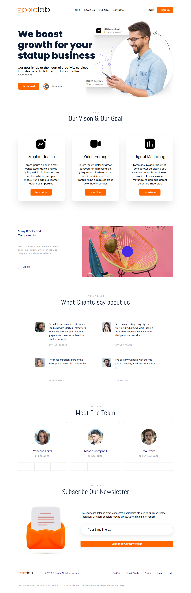
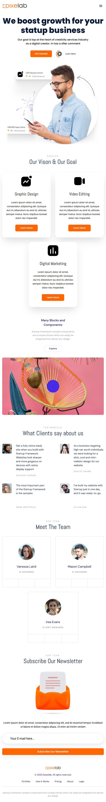

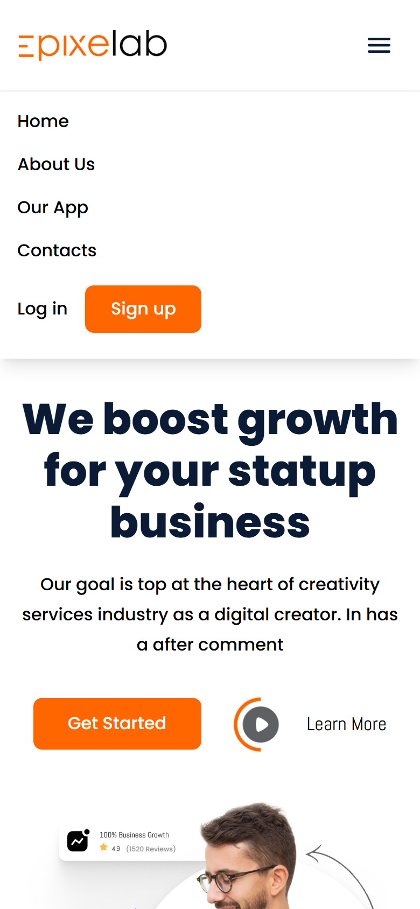

# Ostad MERN – Responsive Landing Page (Module 2 Assignment)

A pixel-close HTML/CSS conversion of the **first design ("Landing Page" – Epixelab)** from the Ostad MERN Figma file, made fully responsive with **Tailwind CSS**.

**Figma design:** [Ostad MERN Landing Page](https://www.figma.com/design/iWAhzAoOQdYvjOxWQdLJHG/Ostad-MERN-Landing-Page)

## Assignment requirements

| Requirement | Status |
| --- | --- |
| Convert the Figma file to HTML (1st design only) | ✅ |
| Design matches the Figma layout | ✅ |
| Mobile responsive | ✅ |
| Use Tailwind CSS for styling and responsiveness | ✅ |

## Sections

1. **Navbar** – logo, navigation links, Log in / Sign up
2. **Hero** – "We boost growth for your statup business" with call-to-action buttons
3. **Our Vision & Our Goal** – three service cards (Graphic Design, Video Editing, Digital Marketing)
4. **Many Blocks and Components** – text with image
5. **Testimonials** – "What Clients say about us"
6. **Meet The Team** – three team member cards
7. **Newsletter** – email subscription form
8. **Footer** – copyright and links

## Features

- **Responsive layout** for mobile, tablet, laptop and desktop (tested at 360, 390, 768, 1024, 1280 and 1440 px, with no horizontal scrolling)
- **No JavaScript** – the mobile menu opens and closes using only HTML and CSS (a hidden checkbox and Tailwind's `peer-checked`)
- **HTML and CSS kept separate** – all styles live in `style.css`
- **Google Fonts** that match the design: Poppins, Abel, DM Sans and Roboto

## Tech stack

- HTML5
- Tailwind CSS v3, compiled into `style.css`
- Google Fonts

## Project structure

```
ostad-m2/
├── index.html      # Page markup
├── style.css       # Compiled Tailwind CSS
├── images/         # Design assets
└── screenshots/    # Screenshots used in this README
```

## How to run

No install or build step is needed. Clone the repository and open `index.html` in a browser:

```bash
git clone https://github.com/HRSHAFIN/ostad-m2.git
cd ostad-m2
```

## Screenshots

### Desktop (1440px)



### Tablet (768px)



### Mobile (390px)

<p>
  
  &nbsp;&nbsp;
  
</p>

## Author

**HRSHAFIN** – Ostad MERN Stack Development course
